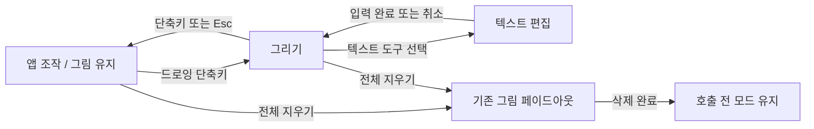

# My Brush v0.1 개발 계획

작성일: 2026-09-08. 상태: 준현님이 핵심 v0.1 구현을 승인했다. 추가 기능은 고도화 단계로 연기하며 현재 구현·검증 진행 중이다. 아래 검증 기준은 실측 완료를 뜻하지 않는다.

근거 문서: [제품·기술·라이선스 조사](../research/2026-09-08-screen-annotation.md).

## 1. 목표와 확정된 요구사항

강사가 macOS와 Windows에서 화면을 공유하면서, 필요한 표시를 그린 뒤 직접 지우기 전까지 유지하는 가벼운 데스크톱 도구를 만든다.

- macOS와 Windows를 지원한다.
- 모니터 전체 공유·빔프로젝터 출력을 우선 지원한다. 특정 앱 창만 공유하는 기능은 첫 버전의 보장 범위에서 제외한다. (준현님 응답)
- 전역 단축키로 드로잉 모드에 진입한다.
- 선·텍스트는 시간 경과로 사라지지 않는다. 삭제 명령을 받으면 부드럽게 페이드아웃한다.
- 펜 굵기·색상 팔레트·텍스트 입력을 제공한다.
- AI나 다른 프로그램과 함께 쓸 때 자원 사용을 줄이는 것이 핵심 품질 목표다.
- 오픈소스로 공개하고 장래 GitHub에서 설치 파일을 다운로드하게 한다.
- 배포물에서 원저작자와 원본 출처가 준현님임을 알 수 있게 고지 보존을 의무화한다. 수정본 소스 공개 의무나 앱 메인 화면의 상시 이름 표시까지 확정한 것은 아니다. (준현님 후속 응답 해석)
- 당장은 리모트 저장소를 연결하지 않는다. 개발은 기능별 시맨틱 커밋으로 기록한다.
- Windows PC에서 준현님이 직접 기능·화면공유 테스트를 할 수 있다. (준현님 응답)

현재 폴더는 빈 상태이며 Git 저장소가 아니다. 아래 소스 경로는 **구현 시 생성할 예정 경로**이고 기존 파일에 대한 설명이 아니다.

## 2. 권장 기술과 결정 조건

잠정 선택: **Tauri 2 + Rust + TypeScript + Canvas 2D**, 소규모 설정·팔레트 UI에는 Svelte + Vite를 후보로 사용한다. Svelte 선택은 생산성 판단이며 최종 메모리 절감을 검증한 결과가 아니다. Canvas의 매 포인터 이벤트를 UI 프레임워크 상태 갱신으로 연결하지 않는다.

| 선택지 | 장점 | 비용 / 한계 | 판단 |
| --- | --- | --- | --- |
| Tauri + 웹 캔버스 + OS 보완 | 공통 드로잉 구현, 작은 배포 크기에 유리, 웹 기반 한글 입력·설정 UI | 서로 다른 WebView, macOS 투명 WebView의 private API, 전체화면·포커스 보완 가능성 | 첫 기술 실험의 기본안 |
| Rust 공통 모델 + macOS/Windows 네이티브 캔버스 | WebView 없이 오버레이·렌더링 자원을 직접 제어할 여지 | 두 렌더러와 텍스트·입력 통합을 유지해야 함 | Tauri 경로가 측정 목표나 OS 안정성 기준에 미달하면 전환 후보 |
| Electron | 공통 Chromium 엔진과 관련 API | 런타임 포함 비용, 네이티브 전체화면·공유 검증은 여전히 필요 | 현재 경량화 우선순위에서는 후순위 |

Tauri를 확정하는 조건은 다음과 같다. 투명 오버레이, 유지+클릭 통과, 전역 단축키, macOS 전체화면, Windows 혼합 DPI, 한글 조합, 수신 화면 표시를 실제 환경에서 통과해야 한다. 네이티브 패치로 해결 가능한 문제는 OS 어댑터 안에 제한하고, 렌더러 전체 교체가 필요한 경우 측정 결과를 근거로 계획을 갱신한다.

App Store 배포는 현재 범위가 아니다. Tauri 문서에 명시된 macOS 투명 창의 private API 제약을 수용한 직접 배포안을 검증한다. 이후 App Store가 필요해지면 네이티브 오버레이 경로를 다시 검토한다. [Tauri 창 API](https://v2.tauri.app/reference/javascript/api/namespacewindow/)

## 3. 사용 흐름

모드 전환과 그림 삭제를 분리한다. 사용자가 조작 모드로 돌아가더라도 그림은 남고, 클릭·스크롤·키보드는 뒤쪽 앱으로 돌아간다. 그림은 화면 좌표에 고정된다. 브라우저 스크롤이나 슬라이드 변경에 맞춰 콘텐츠를 따라가는 기능은 포함하지 않는다.



기본 조작안은 모두 변경 가능하도록 한다. 실제 키 충돌을 실험한 뒤 초기 값을 확정한다.

| 기능 | macOS 후보 | Windows 후보 | 범위 |
| --- | --- | --- | --- |
| 드로잉 ↔ 앱 조작 | Option+Shift+D | Alt+Shift+D | 전역 등록 |
| 전체 그림 지우기 | Option+Shift+X | Alt+Shift+X | 전역 등록, 그림이 있을 때 동작 |
| 앱 조작으로 복귀 | Esc | Esc | 드로잉 중 로컬 처리 |
| 실행 취소 / 다시 실행 | Cmd+Z / Cmd+Shift+Z | Ctrl+Z / Ctrl+Shift+Z | 드로잉 중 로컬 처리 |
| 팔레트 프리셋 | 숫자 1~6 | 숫자 1~6 | 텍스트 입력 중에는 일반 문자로 처리 |
| 굵기 조절 | [ / ] 또는 UI | [ / ] 또는 UI | 텍스트 입력 중에는 일반 문자로 처리 |

- 드로잉에서 Esc는 삭제하지 않고 앱 조작으로 복귀한다.
- 텍스트 편집에서는 첫 Esc가 편집 취소, 다음 Esc가 앱 조작 복귀다. 조합 중 Enter는 한글 조합 완료가 우선이고, 조합 중이 아닐 때 입력 확정을 처리한다. Shift+Enter는 줄바꿈 후보로 검증한다.
- 전체 지우기의 기본 fade 길이는 350ms로 제안한다. 애니메이션 줄이기 설정에서는 즉시 삭제한다.
- 전체 지우기는 실행 취소 한 번으로 복구 가능하게 한다. fade 중 새로 그린 선은 삭제되지 않는다. 지우기 요청 시점의 객체만 대상으로 고정한다.
- 여러 모니터에 그림이 있으면 기본 ‘전체 지우기’는 모든 모니터에 적용한다. 모니터별 지우기는 후속 기능이다.
- ‘유지’는 실행 세션 중 시간제 소멸이 없다는 뜻이다. 재시작 이후 복구·디스크 자동 저장은 별도 기능이다.
- 등록 충돌이나 권한 오류가 나면 트레이 메뉴로 진입·조작 복귀·종료할 수 있어야 한다. 실패를 성공한 전환처럼 표시하지 않는다.

## 4. 기능 범위

| 단계 | 포함 기능 |
| --- | --- |
| 기술 실험 | 단일 투명 캔버스, 테스트 선 유지, 전역 모드 전환, 클릭 통과, fade 삭제, 간단한 한글 입력, 두 OS 전체화면·공유·성능 확인 |
| v0.1 필수 | 자유곡선, 굵기 1~32 논리 픽셀, 6개 빠른 색+전체 색상 선택, 한글·영문 여러 줄 텍스트, 지우개, 실행 취소/다시 실행, 전역 단축키 변경, 트레이, 설정 저장, 모니터별 그림 유지·대상 선택 |
| 고도화로 연기 | 직선·화살표·사각형·타원, 색+굵기+불투명도 프리셋, 형광펜. 준현님의 범위 확정에 따라 v0.1에서 제외한다. |
| v0.2 후보 | 유지 펜과 자동 소멸 레이저 병용, 숫자 배지, 커서 강조, 화이트/블랙보드, 그림 잠시 숨김·복원, 그림만 PNG 내보내기 |
| 이후 후보 | 스냅샷·세션 저장, 스포트라이트, 확대, 선택 이동·편집, 필압·펜 입력 정식 지원 |

첫 버전에 화면 녹화, 실시간 화면 캡처·합성, AI 기능, 계정, 클라우드 동기화, 모바일 리모컨, 앱 콘텐츠 추적을 넣지 않는다. 기본 입력은 마우스·트랙패드다. 태블릿 필압은 구현·기기 검증을 거친 뒤 별도 지원한다.

모니터마다 벡터 장면을 유지하되 v0.1은 한 번에 선택한 한 모니터에서 그린다. 다른 모니터의 그림은 표시·클릭 통과 상태를 유지한다. 모니터 경계를 한 획으로 가로지르는 기능은 후속 범위다. 화면 미러링은 실제 OS 디스플레이 구성을 따라 하나의 출력으로 처리하는지 검증한다.

## 5. 구현 구조

예정 경로:

```text
src/
  model/annotation.ts           # stroke, text, shape와 직렬화 버전
  model/history.ts              # 생성·삭제·전체 삭제 undo/redo
  canvas/renderer.ts            # Canvas 2D, 그릴 때만 갱신
  canvas/input.ts               # 좌표 변환·포인터·composition 입력
  canvas/fade.ts                # 삭제 대상 세대와 애니메이션
  ui/Toolbar.svelte             # 펜·팔레트·굵기·텍스트
  ui/Settings.svelte            # 단축키·프리셋·설정
  app/mode.ts                   # frontend의 모드 표시·전환 ACK
src-tauri/
  src/lib.rs
  src/overlay.rs                # 창 생명주기·모드 전환 조정
  src/shortcuts.rs              # 전역 단축키·충돌·키 반복 방지
  src/displays.rs               # 모니터 ID·좌표·배율·연결 변경
  src/platform/macos.rs         # 필요한 AppKit 보완만 격리
  src/platform/windows.rs       # 필요한 Win32 보완만 격리
  src/settings.rs               # 버전 있는 로컬 설정 저장
  capabilities/                # 창 역할별 최소 IPC 권한
  tauri.conf.json
docs/
  testing/compatibility.md      # OS·회의 앱·DPI 검증 결과
  testing/performance.md        # 동일 시나리오 측정 결과
  adr/0001-overlay-stack.md     # 실험에 따른 기술 확정 근거
```

- OS 모드·단축키·창 생명주기의 권위는 Rust에 둔다. 포인터 샘플과 진행 중 획은 해당 캔버스에서 처리하고 매 점마다 IPC 왕복하지 않는다.
- 완료된 객체·편집 명령은 ID와 순서 번호로 관리한다. 모드 전환에는 ACK·실패 처리를 두어 UI 표시와 실제 클릭 통과 상태가 엇갈리지 않게 한다.
- 벡터 모델을 캔버스 구현과 분리해 OS별 렌더러 전환 시 포맷·테스트 재사용이 가능하게 한다. 성급하게 두 렌더러를 동시에 개발하지 않는다.
- 정지 장면은 반복적으로 다시 그리지 않는다. 입력·장면 변경·fade 중에만 렌더링을 예약한다. fade 완료는 단조 시계 기준으로 처리해 background throttling 후에도 삭제가 완료되게 한다.
- 창과 풀스크린 비트맵은 사용한 모니터에만 필요 시 생성한다. 단, 표시 중인 그림이 있는 모니터의 창은 유지한다. 도구막대·설정 창 수도 측정 대상에 포함한다.
- 실제 화면 픽셀을 읽지 않는 기본 펜을 설계한다. 접근성·입력 모니터링 권한은 선택한 OS API가 실제 요구하는 경우에만 설명·요청한다. 나중에 화면 캡처·확대 기능을 추가하면 그 권한을 별도로 취급한다.
- 로컬 리소스로 동작하며 원격 페이지·외부 스크립트 로딩을 포함하지 않는다. 앱 조작 모드에서 일반 키를 가로채지 않는다.

## 6. 합격 기준

모든 수치는 **제안하는 품질 목표**다. 측정 결과나 Tauri의 보장값이 아니다. 기준 장비의 OS·CPU·RAM·디스플레이·배율·전원 모드를 기록하고, 첫 실험에서 과도한 목표는 준현님과 근거를 보고 조정한다.

| ID | 기준 | 검증 |
| --- | --- | --- |
| A01 | 선·텍스트를 만든 뒤 30분, 앱 전환 100회, 모드 전환 100회를 지나도 명시적 삭제 없이 소멸하지 않음 | 양 OS 실제 앱, 장면 객체 수 비교 |
| A02 | 펜 입력을 받는 동안 뒤 앱에 의도하지 않은 클릭·문자 입력이 0회 | 링크·버튼·텍스트 편집기를 배경으로 각 100회 |
| A03 | 조작 모드에서 그림을 보존한 채 클릭·스크롤·드래그·키보드가 뒤 앱에서 동작, 전환 반복 100회 오류 0회 | macOS/Windows 실기 |
| A04 | 기본 fade 350ms±100ms 후 대상 객체 삭제 완료. fade 중 새 선 보존. 전체 삭제 undo 가능 | 가상 시계 단위 검사+OS 실제 애니메이션 |
| A05 | 단축키 등록 성공 시 100회 전환 성공. 키 반복으로 모드가 재차 토글되지 않고 충돌 시 오류·재설정 안내 제공 | 백그라운드·키보드 레이아웃 변경 포함 |
| A06 | 굵기 1~32·색상 변경이 다음 획에 적용. 설정은 재시작 후 유지 | UI 조작+설정 파일 round-trip |
| A07 | 한글 조합·받침 수정·한영 전환·줄바꿈·확정·취소가 양 OS에서 정상. 단축키 문자 오작동 0회 | ‘강의 자료를 설명합니다’ 입력·수정 사례 |
| A08 | 1080p/4K, Windows 100/125/150/200%, Retina 혼합 배율에서 시험점 좌표 오차 ≤2 논리 픽셀 | 모니터별 고정 표적·음수 화면 원점 포함 |
| A09 | 확장·미러링·연결 해제 10회에 입력을 막는 고아 창 0개, 재연결 시 장면 복원 | 실물 모니터/프로젝터. 분리된 장면은 메모리에 보관 |
| A10 | Zoom·Google Meet의 전체 모니터 공유에서 수신자가 선·한글·fade를 볼 수 있음. 빔 출력에서도 확인 | 준현님의 양 OS, 수신 장치에서 확인. 앱 버전 기록 |
| A11 | Keynote/PowerPoint 슬라이드쇼·브라우저 전체화면에서 그리기→조작→삭제 성공 | macOS Keynote/브라우저, Windows PowerPoint/브라우저. 준비되지 않은 조합은 미검증 표기 |
| A12 | release 빌드 60초 안정화 후 5분 정지 상태 평균 CPU ≤단일 코어의 1%, 불필요한 지속 draw loop 없음 | 두 OS, 자식 WebView 프로세스 포함 CPU 시간 기반 정규화 |
| A13 | 1개 1080p 화면·기본 장면에서 앱 및 귀속 WebView 프로세스 메모리 합 ≤200MiB 목표 | macOS RSS 합, Windows working set 합을 OS별 기록. GPU/공유 메모리는 별도 기록 |
| A14 | 드로잉 중 p95 앱 내부 렌더 시간 ≤16.7ms, 포인터→표시 end-to-end 지연 목표 ≤50ms | 내부 계측과 고속 촬영 가능 시 외부 측정 구분. 측정 못 한 수치는 미검증 |
| A15 | 최초 실행→단축키 수신 준비 ≤2초 목표, 일반 전환→입력 가능 p95 ≤150ms | release 빌드 각 20회, 첫 설치·재실행 분리 |
| A16 | 1,000획/100,000점+100텍스트 장면, 2개 4K 화면에서 오류 없이 처리. 생성/전체 삭제 20회 뒤 메모리가 계속 증가하지 않음 | 포인트 저장·캐시·undo 제한 측정. 기록 한계는 사용자 그림 자동 삭제 없이 처리 |
| A17 | 화면공유+동일 AI/프로그램 작업에서 앱 없는 경우 대비 공유 프레임 누락 증가 ≤1%p 목표 | 같은 부하 스크립트로 교대 측정. 계측 가능한 공유 앱에서만 수치 판정 |
| A18 | 네트워크 연결 없이 드로잉·설정·텍스트 사용, 배포 앱이 자체적으로 주기적 외부 통신하지 않음 | 개발 서버 제외한 release 빌드 네트워크 관찰 |
| A19 | 선택한 라이선스 원문·원저작자 출처 고지·의존성 고지가 소스와 양 OS 설치 배포물에 포함됨. 자체 앱 정보 화면에서 원저작자·원본 저장소 확인 가능 | 압축 해제·설치 후 LICENSE/NOTICE 확인, 공개 시 실제 저장소 URL 검사 |

200MiB는 4K 두 화면의 전체 사용량을 보장하는 값이 아니다. 고해상도 시나리오의 예산은 위 버퍼 산술과 실험값으로 별도 정한다. 각 OS의 메모리 지표는 동일하지 않으므로 단순 수치만으로 OS 간 우열을 주장하지 않는다.

## 7. 단계별 실행과 커밋

| 순서 | 작업 | 종료 조건 | 커밋 예시 |
| --- | --- | --- | --- |
| 0 | 계획 합의 후 로컬 Git 초기화, 프로젝트 구조·라이선스 선택 기록 | 로컬 저장소·기본 빌드, 리모트 없음 | `chore(project): 로컬 개발 기반 구성` |
| 1 | 양 OS 오버레이 실험, 최소 한글·포커스·공유·성능 측정 | 핵심 API와 A02~A05/A07/A10/A11 최소 시나리오 확인, 기술 ADR 작성 | `feat(overlay): 화면 오버레이와 입력 전환 검증` |
| 2 | 벡터 획·시간 제한 없는 유지·수동 fade·undo/redo | A01/A04, 새 획 보존·전체 삭제 복구 | `feat(ink): 고정 필기와 페이드 삭제 구현` |
| 3 | 팔레트·굵기·프리셋·지우개·설정 | A06, 선택 삭제 복구 | `feat(tools): 펜 설정과 지우개 추가` |
| 4 | 텍스트 도구·한글 IME | A07, 텍스트 입력 중 단축키 간섭 없음 | `feat(text): 한글 텍스트 주석 지원` |
| 5 | 여러 모니터·혼합 DPI·연결 변경·전체화면 안정화 | A08~A11 | `feat(displays): 다중 화면 필기 지원` |
| 6 | 실제 강의 부하 프로파일링·불필요한 갱신 제거 | A12~A18 결과와 미검증 항목 기록 | `perf(render): 대기 렌더링과 메모리 사용 개선` |
| 7 | 로컬 설치 파일·문서·라이선스 고지·양 OS 설치 검증 | 설치/업그레이드/제거·서명 계획 검토 가능 | `build(release): 데스크톱 배포 패키지 준비` |

각 행은 작업 묶음의 예시다. 큰 단계는 독립 검증 가능한 기능 단위로 나누고 하나의 커밋에 무관한 수정은 포함하지 않는다. 전체화면·한글의 존재 여부 검증은 1단계에 당겨 수행하고 정식 기능 완성은 후속 단계에서 한다.

Windows 빌드는 Windows 환경에서 검증하고, macOS 빌드·공증은 macOS에서 검증한다. 당장은 수동 빌드·테스트 절차를 남기고, 리모트 공개를 요청받으면 GitHub Actions와 Releases를 연결한다. Windows PC 테스트 가능 응답은 원격 접근 권한이나 실행 완료의 근거로 취급하지 않는다.

Git 운영은 준현님이 제공한 AGENTS 지침을 따른다. 스테이징 직전 status·변경 파일 목록 확인 → 무엇을 왜 올리는지 한국어 한 줄 설명 → 관련 파일만 선택 → diff 검토·검증 결과 보고 → 한글 커밋을 수행한다. 커밋 본문에는 세부 작업을 목록으로 남긴다. 위험하거나 범위가 큰 커밋은 계획을 먼저 제시한다. 별도 요청 없이 push하지 않는다.

예시:

```text
feat(ink): 고정 필기와 페이드 삭제 구현

- 모드 전환 후에도 화면의 필기를 유지
- 삭제 명령에 350ms 페이드 적용
- 삭제 도중 새로 그린 선을 보존
```

## 8. 위험과 대응

| 위험 | 대응 / 판정 시점 |
| --- | --- |
| macOS 투명 창·전체화면이 불안정 | 1단계 실제 Keynote/브라우저 검증, AppKit 보완 격리, 실패 시 네이티브 캔버스 비교 |
| 클릭 통과 전환 실패로 강의 조작이 막힘 | Rust에서 전환 결과 확인·실패 시 조작 복귀, 트레이 복구·종료 경로, 100회 반복 |
| 한글 조합 중 모드 전환·키 충돌 | 1단계 IME 실험, 입력 중 도구 문자키 비활성, 실제 OS IME 검사 |
| 고해상도·WebView 자원 사용 | 1단계 release 기준 측정, 사용 모니터만 생성, 캐시 예산·정지 재렌더링 중단 |
| 회의 수신 화면에 그림이 누락 | 모니터 전체 공유를 기본 안내, 수신 화면 검증표, 실패한 앱/모드는 미지원 명시 |
| 모니터 분리·DPI 변경으로 좌표 깨짐 | 디스플레이 ID와 논리 좌표 모델, 분리 장면 보존, 변환 검사와 실기 |
| 장시간 사용 시 점·undo 데이터 증가 | undo 이력 상한·메모리 예산 설정, 획 단순화는 시각 오차 검증 후 적용, 현재 그림 임의 소멸 금지 |
| 라이선스·이름·서명 배포 문제 | 독립 UI/자산, LICENSE 선택, 의존성 고지, 공개 전 이름 검토, 실제 설치·서명 검증 |

Windows 보안 데스크톱/UAC 화면, DRM 보호 콘텐츠, 게임의 독점 전체화면은 일반 강의 앱과 다른 경로이므로 v0.1에서 보장하지 않는다. 일반 권한으로 실행하고 우회·권한 상승을 기본 전략으로 삼지 않는다.

## 9. 검증 전략과 후속 결정

도메인 단위 검사: 유지 정책, fade 대상 ID, 삭제 중 새 획, undo/redo, 좌표 변환, 설정 직렬화. UI 검사는 주요 동작을 대상으로 하며 버튼 존재만 확인하는 검사는 늘리지 않는다. 브라우저 테스트를 실제 Tauri 창·OS 입력·화면공유 검증의 대체로 쓰지 않는다.

실제 강의 시나리오: 모니터 공유 → 브라우저/슬라이드에 펜 표시 → 조작 모드로 돌아가 코드 실행 또는 AI 요청 → 한글 설명 추가 → 단축키로 전체 삭제 → 다음 설명. 양 OS에서 이 흐름을 반복하고 수신 화면을 함께 확인한다.

후속 결정은 다음 순서로 다룬다. (1) 핵심 흐름·추가 기능 우선순위, (2) 출처 표시 요구에 맞춘 Apache-2.0 + NOTICE 권장안 적용과 저작권자 표시 이름, (3) 최소 지원 OS·CPU와 실제 강의 앱 목록, (4) 기술 실험 결과를 통한 Tauri 확정, (5) 공개 직전 서명·공증 비용과 리모트 연결. 현 단계에서 라이선스 파일 생성, 인증서 구매, 공개 배포를 실행한 상태는 아니다.

## 10. 원저작자와 출처 표시

확정 요구: 배포되는 원본·수정본에 원저작자와 원본 출처에 관한 고지를 보존하게 한다. 권장 수단은 Apache-2.0 표준 LICENSE와 프로젝트 NOTICE다. NOTICE에는 저작권자 이름·연도·프로젝트 이름·공개 후 원본 저장소 URL을 담고, CONTRIBUTING에는 원본 고지 유지와 변경분 표시 원칙을 설명한다. 별도의 강한 표시 의무를 NOTICE에 삽입해 표준 라이선스를 바꾸지 않는다.

Apache-2.0 제4조는 관련 출처 고지 사본을 배포물의 NOTICE·소스/문서·해당 고지 화면 등 허용되는 위치에 포함하도록 한다. 앱 메인 화면·홍보물에서 원저작자 이름을 상시 표시하는 의무는 아니며, 수정본의 소스 공개도 요구하지 않는다. 두 요구가 추가되면 라이선스 선택을 다시 검토한다. 자체 앱은 정보 화면에서도 출처를 확인할 수 있게 설계한다. [Apache-2.0 원문](https://www.apache.org/licenses/LICENSE-2.0.html)
