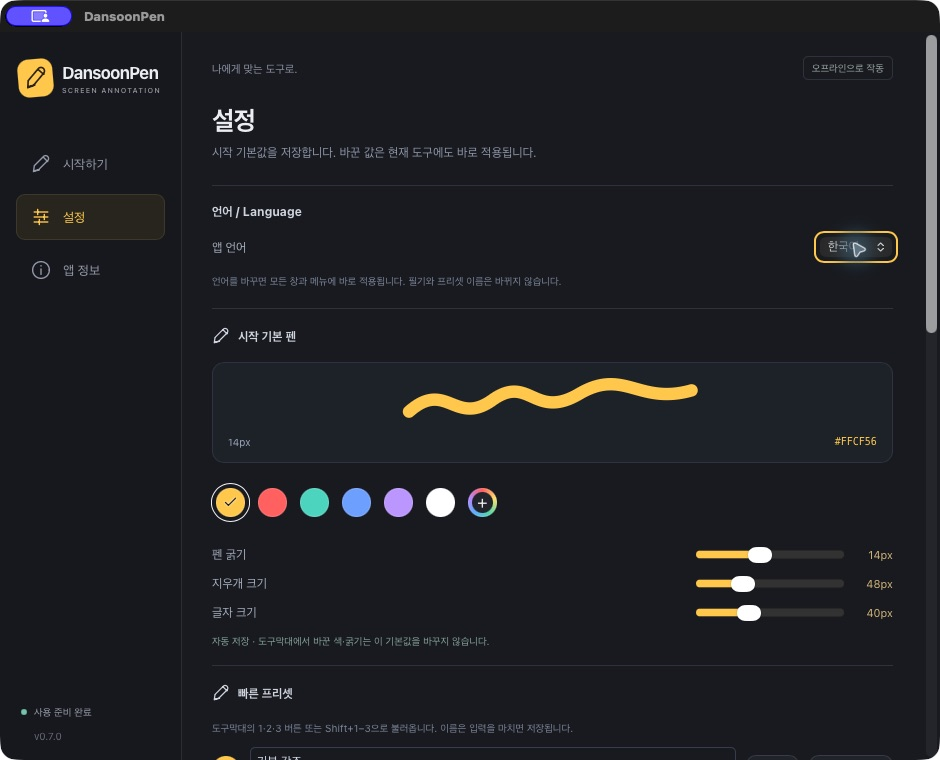

<div align="center">
  
  <h1>DansoonPen</h1>
  <p><strong>화면 위에 그리고, 설명이 끝날 때까지 남겨 두세요.</strong></p>
  <p>강의·라이브 코딩·발표를 위한 화면 필기 도구.</p>
  <p><a href="README.md">English</a> · <strong>한국어</strong></p>
  <p><a href="#다운로드">다운로드</a> · <a href="#시작하기">시작하기</a> · <a href="#단축키">단축키</a> · <a href="#사용법">사용법</a> · <a href="CONTRIBUTING.ko.md">기여하기</a></p>
</div>

DansoonPen은 별도 화이트보드를 열지 않고 슬라이드·코드·사용 중인 앱 위에 필기를 남기는 도구입니다. 직접 지우기 전까지 표시가 유지되며, 뒤쪽 앱을 조작할 때도 필기가 남습니다. 지운 뒤에는 같은 도구로 바로 이어서 그릴 수 있습니다.

**Tauri·Rust·Svelte·Canvas**로 만들었습니다. 계정·서버·사용 통계 업로드 없이 로컬에서 작동합니다.

## 다운로드

| 플랫폼 | 요구 사항 | 설치 파일 |
| --- | --- | --- |
| macOS | macOS 13 이상 · Apple Silicon(M 시리즈) | [macOS 다운로드 (.zip)](https://github.com/jake920220/dansoonpen/releases/download/v0.7.1/DansoonPen-0.7.1-macOS-arm64.zip) |
| Windows | Windows 10/11 · Intel/AMD x64 | [Windows 다운로드 (.exe)](https://github.com/jake920220/dansoonpen/releases/download/v0.7.1/DansoonPen-0.7.1-Windows-x64-setup.exe) |

**v0.7.1 프리릴리스** · [릴리스 안내·체크섬](https://github.com/jake920220/dansoonpen/releases/tag/v0.7.1). 두 플랫폼 모두 설치·실행 및 기본 사용을 확인했습니다. Intel Mac·Windows ARM 네이티브 빌드는 제공하지 않습니다.

## 주요 기능

- **사라지지 않는 필기.** 시간에 따라 자동 삭제되지 않고, 직접 지울 때만 사라집니다.
- **설명 흐름 유지.** 지우기는 도구와 메뉴 독을 유지합니다. 앱 조작 모드로 나가도 필기는 남습니다.
- **펜 이상의 도구.** 형광펜·화살표·재편집 가능한 텍스트·객체 지우개·실행 취소를 제공합니다.
- **여러 모니터에서 사용.** 연결된 화면 어디에서나 그리고, 공용 도구막대를 원하는 모니터로 옮깁니다.
- **나에게 맞는 설정.** 도구 크기·색상환·프리셋 3개·직접 입력하는 전역 단축키를 지원합니다.
- **한국어와 영어.** 설정창·도구막대·트레이 언어를 선택합니다. 텍스트용 나눔고딕이 포함되어 있습니다.



*실제 macOS 설정 화면입니다. 화면의 14px는 저장된 사용자 설정이며, 새 설치의 기본 펜은 12px입니다.*

## 기존 브러시 도구와 무엇이 다른가요?

단순펜은 강의 중 화면 브러시를 사용하며 느낀 불편에서 출발했습니다. 설명은 순간적인 포인터 표시보다 오래 이어지고, 필기와 코드 실행을 자주 오가게 됩니다. 단순펜은 다음 동작을 기본 사용 흐름으로 제공합니다.

| 강의 중 필요한 순간 | 단순펜의 방식 |
| --- | --- |
| 그림을 보며 충분히 설명할 때 | 직접 지울 때까지 필기가 남습니다. 필기 유지에 별도 유료 업그레이드가 필요하지 않습니다. |
| 지우고 바로 이어서 그릴 때 | 짧은 페이드로 필기만 지우고 선택한 도구와 메뉴 독을 유지합니다. |
| 코드를 실행한 뒤 다시 필기할 때 | 앱 조작 중에도 필기는 남고, 그리기에 재진입하면 저장된 기본 펜으로 시작합니다. |
| 수강생 앞에서 글자를 고칠 때 | 기존 텍스트를 클릭해 다시 편집합니다. 기본 글자 크기는 40px이며 한글 가독성을 위해 나눔고딕을 포함합니다. |
| 여러 화면·언어로 강의할 때 | 앱에서 한국어·영어를 전환하고 하나의 공용 도구막대를 모니터 사이로 옮깁니다. |
| 도구를 직접 살펴보고 개선할 때 | 계정·구독 없이 사용하며 Apache-2.0 소스를 공개합니다. Tauri/Rust와 OS WebView로 구현했습니다. |

다른 도구에도 겹치는 기능이 있습니다. [DrawPen](https://github.com/DmytroVasin/DrawPen)은 여러 필기 도구와 macOS·Windows·Linux 지원을 제공하고, [gInk](https://github.com/geovens/gInk)도 오픈소스 화면 필기 도구입니다. 단순펜은 위 동작의 조합과 강의 흐름에 집중합니다. Apple Silicon Mac과 Windows x64에서 기본 사용을 확인했습니다. 다른 도구와의 메모리·속도 비교 측정은 아직 하지 않았습니다.

## 시작하기

아래 설치 파일은 개발 도구 없이 실행할 수 있습니다. Node.js·Rust는 소스에서 직접 빌드할 때만 필요합니다. GitHub의 **Source code** 압축 파일은 설치용 앱이 아닙니다.

### 다운로드·설치 — macOS

1. [macOS Apple Silicon용 ZIP을 다운로드](https://github.com/jake920220/dansoonpen/releases/download/v0.7.1/DansoonPen-0.7.1-macOS-arm64.zip)하세요. M 시리즈 Mac, macOS 13 이상이 필요합니다.
2. 압축을 풀고 **DansoonPen.app**을 **응용 프로그램** 폴더로 옮기세요. 기존 앱을 교체한다면 실행 중인 이전 버전을 먼저 종료하세요.
3. 앱을 열고 **Option+Z**로 필기를 시작하세요.

**서명 안내:** 이번 프리릴리스는 ad-hoc 서명만 적용했고 Apple Developer ID 서명·공증은 받지 않았습니다. 첫 실행이 차단될 수 있습니다. 이 저장소에서 직접 받은 신뢰할 수 있는 앱인지 확인한 후 [Apple의 미공증 앱 실행 안내](https://support.apple.com/ko-kr/102445)를 참고하세요. Gatekeeper 전체를 끄지 마세요.

[SHA256SUMS.txt](https://github.com/jake920220/dansoonpen/releases/download/v0.7.1/SHA256SUMS.txt)와 알려진 한계는 [릴리스 페이지](https://github.com/jake920220/dansoonpen/releases/tag/v0.7.1)에서도 확인할 수 있습니다. Intel Mac 설치 파일은 아직 제공하지 않습니다.

### 다운로드·설치 — Windows

1. [Windows x64 설치 파일을 다운로드](https://github.com/jake920220/dansoonpen/releases/download/v0.7.1/DansoonPen-0.7.1-Windows-x64-setup.exe)하세요. Windows 10/11의 일반 Intel/AMD x64 PC용입니다.
2. 실행 중인 이전 버전을 종료하고 **설치 프로그램(.exe)**을 실행하세요.
3. 시작 메뉴에서 DansoonPen을 열고 **Alt+Shift+Z**로 필기를 시작하세요. **Alt+Shift+X**는 전체 삭제입니다.

WebView2가 없으면 설치 과정에서 다운로드하므로 인터넷 연결이 필요할 수 있습니다.

**서명 안내:** 이번 프리릴리스에는 코드 서명이 없어 SmartScreen 또는 알 수 없는 게시자 안내가 나타날 수 있습니다. 출처와 [Windows 체크섬](https://github.com/jake920220/dansoonpen/releases/download/v0.7.1/SHA256SUMS-Windows.txt)을 확인하세요.

### 소스에서 실행

[Node.js](https://nodejs.org/)·[Rust](https://rustup.rs/)와 [Tauri의 OS별 준비 도구](https://v2.tauri.app/start/prerequisites/)를 설치하세요. 로컬 검증에는 Node.js 26·Rust 1.94를 사용하며 macOS 최소 설정은 13.0입니다. Windows 개발에는 Microsoft C++ Build Tools와 WebView2가 필요합니다.

저장소를 복제한 뒤 실행합니다.

```sh
git clone https://github.com/jake920220/dansoonpen.git
cd dansoonpen
npm ci
npm run tauri dev
```

macOS에서 독립 실행 앱을 만들려면:

```sh
npm run tauri build -- --bundles app
```

`src-tauri/target/release/bundle/macos/DansoonPen.app`을 실행하세요. 자세한 빌드·패키징 절차는 [기여 안내](CONTRIBUTING.ko.md)에 있습니다. 로컬 macOS 빌드는 Developer ID 서명·Apple 공증을 완료한 공개 배포본이 아닙니다.

### 첫 필기

1. 앱을 실행하고 **그리기 시작** 또는 macOS **Option+Z**를 누릅니다.
2. 펜으로 표시합니다. 도구막대에서 도구·색·크기를 바꿀 수 있습니다.
3. **Option+Z**를 다시 누르거나 **Esc**를 누르면 뒤쪽 앱을 조작합니다. 필기는 유지되고 메뉴 독은 사라집니다.
4. **Option+Z**로 다시 그리기 시작합니다. 재진입할 때는 저장해 둔 기본 펜이 선택됩니다.
5. **Option+X** 또는 휴지통은 모든 필기를 지웁니다. 그리기 중이었다면 선택 도구와 메뉴 독이 유지됩니다.

Windows 기본 단축키는 **Alt+Shift+Z**, **Alt+Shift+X**이며 설정에서 바꿀 수 있습니다.

**화면공유는 모니터 전체를 선택하세요.** 특정 앱 창만 공유하면 필기 오버레이가 포함되지 않을 수 있습니다. 강의 전에 수신 화면에서도 확인하세요.

## 단축키

전역 단축키는 다른 앱을 사용하는 중에도 동작하며 설정에서 변경할 수 있습니다. 아래는 기본 조합입니다.

| 동작 | macOS | Windows |
| --- | --- | --- |
| 그리기 ↔ 앱 조작 | `Option+Z` | `Alt+Shift+Z` |
| 전체 지우기 · 현재 모드와 도구 유지 | `Option+X` | `Alt+Shift+X` |
| 필기 숨기기 / 다시 표시 | `Option+V` | `Alt+Shift+V` |
| 설정 · DansoonPen 활성화 상태 | `Cmd+,` | `Ctrl+,` |
| 필기를 유지하고 앱 조작 | `Esc` | `Esc` |
| 실행 취소 / 다시 실행 | `Cmd+Z` / `Cmd+Shift+Z` | `Ctrl+Z` / `Ctrl+Shift+Z` |

그리기 중 **P** 펜 · **H** 형광펜 · **A** 화살표 · **T** 텍스트 · **E** 지우개 · **C** 커서 강조를 사용합니다. **1–6**은 빠른 색상, **[ / ]**는 도구 크기, **Shift+1–3**은 프리셋입니다. 텍스트 편집 중에는 도구 문자키가 입력을 가로채지 않습니다.

전역 단축키를 바꾸려면 입력칸을 선택하고 키 조합을 누른 뒤 놓고 **단축키 적용**을 누르세요. 등록 충돌은 알려드리지만 OS·다른 앱의 모든 단축키 충돌을 미리 판별할 수는 없습니다.

## 사용법

### 다시 수정할 수 있는 텍스트

**텍스트** 도구로 화면을 클릭해 입력하세요. **Enter** 완료, **Shift+Enter** 줄바꿈, **Esc** 취소입니다. 텍스트 도구로 기존 글을 클릭하면 다시 편집할 수 있습니다. 편집창의 손잡이를 끌어 이동하고 색·크기 조절로 서식을 바꿉니다. 기본 글자 크기는 **40px**입니다.

### 색상·크기·프리셋

빠른 색상을 고르거나 색상환에서 색조·채도·밝기·HEX를 조절하세요. 도구별 크기를 따로 조절하며 기본 펜은 노란색 **12px**입니다. 도구막대는 현재 도구를 변경하고, 설정창은 다음 그리기 진입에 사용할 기본값을 저장합니다. 자주 쓰는 조합은 이름을 붙여 프리셋 3개에 보관할 수 있습니다.

### 지우기·숨기기·복구

휴지통은 모든 화면의 필기를 짧은 페이드로 지웁니다. **그리기 모드를 해제하지 않습니다.** **이 화면만 지우기**는 도구막대가 있는 화면에 적용하며, 트레이의 해당 메뉴는 커서가 있는 화면을 사용합니다. 삭제 후 새 편집이나 실행 취소·다시 실행을 하기 전에는 **방금 지운 필기 되돌리기**로 복구할 수 있습니다. 숨기기·다시 표시는 내용과 이력을 유지합니다.

### 여러 모니터와 도구막대

연결된 다른 화면으로 커서를 옮겨 바로 그리세요. 별도로 그릴 화면을 선택하지 않아도 됩니다. 도구막대의 손잡이를 끌면 다른 모니터로도 이동하며 화면·위치·접힘·간단 보기/전체 보기 상태를 저장합니다. 하나의 획을 모니터 경계 너머까지 연속해서 그리는 동작은 아직 지원하지 않습니다.

### 한국어 / English

**설정 → 언어 / Language**에서 **한국어** 또는 **English**를 고르세요. 재시작 없이 UI와 트레이가 바뀌고 다음 실행에도 유지됩니다. 기존 설치는 한국어로 시작합니다. 작성한 필기와 저장한 프리셋 이름은 변경하지 않습니다.

## 지원 현황과 한계

| 플랫폼 | 현재 상태 |
| --- | --- |
| macOS Apple Silicon | 설치·실행 및 기본 사용 확인 |
| macOS Intel | 미검증 |
| Windows x64 | 설치·실행 및 기본 사용 테스트 통과 — 사용자 PC에서 확인 |
| Linux | 이 프로젝트의 지원 대상 아님 |

- **필기는 임시 데이터입니다.** 메모리에만 보관하며 앱을 종료하면 사라집니다. 세션 저장·이미지 내보내기는 아직 없습니다. 설정창 닫기는 숨기기이며, **앱 종료**는 완전 종료입니다.
- 그림은 화면 좌표에 고정되어 스크롤이나 슬라이드를 따라가지 않습니다. 지우개는 픽셀 일부가 아닌 객체 전체를 지웁니다.
- 두 플랫폼의 기본 사용 확인은 모든 환경의 검증을 의미하지 않습니다. Windows 기본 사용 결과와 추가 검사 범위는 [검증 기록](docs/testing/windows-release-2026-09-21.md)에 정리했습니다.
- 입력·포커스 복구와 회색 오버레이 관련 수정이 포함되어 있습니다. 장시간 강의·잠자기 복귀·혼합 배율·화면공유 수신 환경은 추가 확인이 필요합니다. [검증 기록](docs/testing/verification.md)을 참고하세요.
- 설정과 용량이 제한된 진단 로그는 로컬에 저장합니다. 로그에 필기 내용·화면 이미지를 수집하지 않습니다. 공유 전 내용을 확인하세요. [진단 로그 안내](docs/testing/diagnostics.md)

## 기여하기

재현 가능한 오류 제보, 다양한 환경의 실기 테스트, 번역 개선을 환영합니다. OS·앱 버전, 모니터 배치·배율, 재현 순서, 기대한 동작을 함께 알려 주세요. 스크린샷·로그에서 비공개 강의 자료는 제거해 주세요.

[기여 안내](CONTRIBUTING.ko.md)를 참고하세요. 영문 번역은 [`src/locales/en.json`](src/locales/en.json)에 있으며 `{0}` 같은 치환자는 유지해야 합니다.

## 라이선스

원저작자: **김준현 (Junhyun Kim)**. DansoonPen 코드는 [Apache-2.0](LICENSE)으로 배포합니다. 재배포 시 해당 라이선스·저작권·출처 고지를 보존해야 합니다. [NOTICE](NOTICE)를 참고하세요.

수정 없이 포함한 나눔고딕은 [SIL OFL 1.1](src/assets/fonts/nanum-gothic/OFL.txt)을 따릅니다. 의존성 라이선스 전문은 [THIRD_PARTY_NOTICES.txt](THIRD_PARTY_NOTICES.txt)에 있습니다.

---

단순펜이 강의나 발표에 도움이 되었다면 [이 저장소에 ⭐ Star](https://github.com/jake920220/dansoonpen)를 눌러주시면 감사하겠습니다. 꾸준히 개선하는 데 큰 힘이 됩니다!
