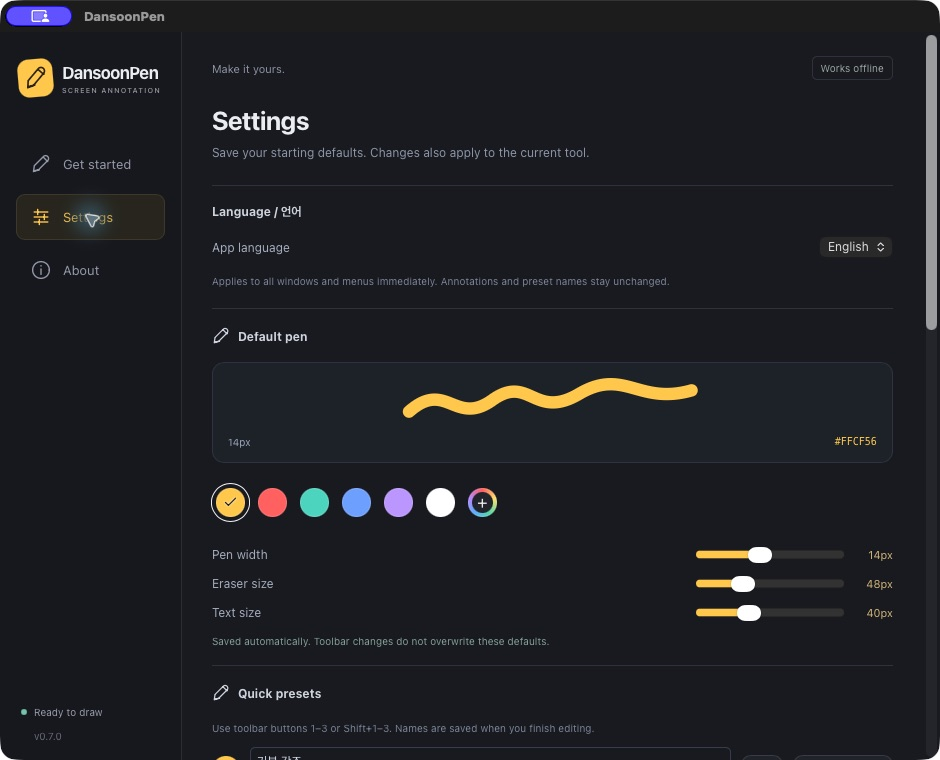

<div align="center">
  
  <h1>DansoonPen</h1>
  <p><strong>Draw on your screen. Keep your explanation visible.</strong></p>
  <p>A desktop annotation tool for teaching, live coding, and presentations.</p>
  <p><strong>English</strong> · <a href="README.ko.md">한국어</a></p>
  <p><a href="#get-started">Get started</a> · <a href="#shortcuts">Shortcuts</a> · <a href="#using-dansoonpen">Usage</a> · <a href="CONTRIBUTING.md">Contribute</a></p>
</div>

DansoonPen lets you mark up slides, code, or any app without switching to a whiteboard. Annotations stay until you clear them—even while you interact with the apps underneath. Clear the screen and keep drawing with the same tool.

Built with **Tauri, Rust, Svelte, and Canvas**. Works locally, without an account, a server, or analytics uploads.

> **[Download v0.7.0 for macOS Apple Silicon](https://github.com/jake920220/dansoonpen/releases/download/v0.7.0/DansoonPen-0.7.0-macOS-arm64.zip)** · [Release notes & checksums](https://github.com/jake920220/dansoonpen/releases/tag/v0.7.0)
>
> First public pre-release · macOS 13+ · Apple Silicon (M-series). Windows and Intel Mac downloads are not available yet.

## Why DansoonPen?

- **Keep your notes visible.** No automatic fade; clearing is a deliberate action.
- **Stay in the flow.** Clearing keeps your current tool and toolbar. Leaving drawing mode keeps your annotations.
- **Explain with more than a pen.** Use a highlighter, arrows, editable text, an object eraser, and undo/redo.
- **Move between displays.** Draw on any connected display and drag the shared toolbar to the one you need.
- **Make it yours.** Adjust widths, use the color wheel, save three presets, and record your own global shortcuts.
- **Choose your language.** Korean and English UI, including the toolbar and tray menu. Nanum Gothic is bundled for text annotations.



*Actual macOS settings window. The 14px pen shown is a saved preference; a fresh installation defaults to 12px.*

## What makes DansoonPen different?

DansoonPen grew out of teaching with a screen brush: explanations often last longer than a quick pointer gesture, and switching between drawing and live coding should take as few steps as possible. Its focus is the default teaching workflow:

| During a lesson | DansoonPen's approach |
| --- | --- |
| Explain a diagram at your own pace | Notes stay until you explicitly clear them; persistence is included without a paid upgrade. |
| Clear the screen and carry on | A short fade clears the notes while preserving your selected tool and toolbar. |
| Run code, then annotate again | Interact mode keeps the notes visible; re-entering drawing always selects your saved default pen. |
| Correct a label in front of the class | Click existing text to edit it again. Text starts at 40px, with Nanum Gothic bundled for Korean readability. |
| Work across languages and displays | Switch Korean/English in the app and move one shared toolbar between monitors. |
| Inspect or adapt the tool | Apache-2.0 source, no account or subscription, and a Tauri/Rust implementation using the OS WebView. |

Other tools also provide overlapping features: [DrawPen](https://github.com/DmytroVasin/DrawPen) offers multiple annotation tools and macOS/Windows/Linux support, and [gInk](https://github.com/geovens/gInk) is another open-source annotation tool. DansoonPen's emphasis is the combination above, with current binary validation limited to Apple Silicon Macs. No comparative memory or speed benchmark has been completed.

## Get started

### Download and install

1. [Download the macOS Apple Silicon ZIP](https://github.com/jake920220/dansoonpen/releases/download/v0.7.0/DansoonPen-0.7.0-macOS-arm64.zip) (M-series Mac, macOS 13 or later).
2. Unzip it and drag **DansoonPen.app** into **Applications**. Quit an older running copy before replacing it.
3. Open DansoonPen and start drawing with **Option+Z**.

The ZIP contains the ready-to-run app; Node.js and Rust are only needed for building from source. The **Source code** archives on GitHub are not the app download.

**Signing:** this pre-release is ad-hoc signed, without an Apple Developer ID signature or notarization. macOS may block the first launch. For an app you downloaded from this repository and trust, follow [Apple's guidance for opening an unnotarized app](https://support.apple.com/en-us/102445). Do not disable Gatekeeper globally.

[SHA256SUMS.txt](https://github.com/jake920220/dansoonpen/releases/download/v0.7.0/SHA256SUMS.txt) and known limitations are included on the [release page](https://github.com/jake920220/dansoonpen/releases/tag/v0.7.0). No Windows or Intel Mac installer is published for this version.

### Install from source

Install [Node.js](https://nodejs.org/), [Rust](https://rustup.rs/), and the [Tauri platform prerequisites](https://v2.tauri.app/start/prerequisites/). Local validation uses Node.js 26 and Rust 1.94; the configured macOS minimum is 13.0. Windows development needs Microsoft C++ Build Tools and WebView2.

Clone the repository and run:

```sh
git clone https://github.com/jake920220/dansoonpen.git
cd dansoonpen
npm ci
npm run tauri dev
```

For a standalone local macOS app:

```sh
npm run tauri build -- --bundles app
```

Open `src-tauri/target/release/bundle/macos/DansoonPen.app`. Build and packaging details are in [CONTRIBUTING.md](CONTRIBUTING.md). Local macOS bundles are not Developer ID signed or notarized public releases.

### Your first annotation

1. Launch DansoonPen and choose **Start drawing**, or press **Option+Z** on macOS.
2. Draw with the pen. The toolbar controls your tool, color, and size.
3. Press **Option+Z** again, or **Esc**, to interact with your apps. Your notes stay visible and the toolbar disappears.
4. Press **Option+Z** to draw again. Each new drawing session starts with your saved default pen.
5. Press **Option+X**, or click the trash button, to clear all annotations. While drawing, the current tool and toolbar stay active.

Windows defaults use **Alt+Shift+Z** and **Alt+Shift+X**. You can change them in Settings.

**For screen sharing, share the entire display.** Sharing an individual app window may exclude the annotation overlay. Check the receiving screen before your lecture.

## Shortcuts

Global shortcuts work while other apps are active and can be changed in Settings. These are the defaults:

| Action | macOS | Windows |
| --- | --- | --- |
| Draw ↔ interact | `Option+Z` | `Alt+Shift+Z` |
| Clear all; keep current mode/tool | `Option+X` | `Alt+Shift+X` |
| Hide / show annotations | `Option+V` | `Alt+Shift+V` |
| Settings, while DansoonPen is active | `Cmd+,` | `Ctrl+,` |
| Interact with apps; keep annotations | `Esc` | `Esc` |
| Undo / redo | `Cmd+Z` / `Cmd+Shift+Z` | `Ctrl+Z` / `Ctrl+Shift+Z` |

While drawing: **P** pen · **H** highlighter · **A** arrow · **T** text · **E** eraser · **C** cursor highlight. Use **1–6** for quick colors, **[ / ]** for tool size, and **Shift+1–3** for presets. Tool shortcuts do not intercept text input.

To customize a global shortcut, focus its field, press and release the combination, then choose **Apply shortcuts**. Registration conflicts are reported; DansoonPen cannot detect every OS or application shortcut in advance.

## Using DansoonPen

### Text you can edit

Select **Text** and click to type. Press **Enter** to finish, **Shift+Enter** for a new line, or **Esc** to cancel. With Text selected, click an existing annotation to edit it again. Drag its handle to move it, or use the editor's color and size controls. The default text size is **40px**.

### Colors, sizes, and presets

Choose a quick color or open the color wheel for hue, saturation, brightness, and HEX input. Each tool has its own size controls; the default pen is yellow and **12px**. The toolbar changes your current tool. Settings save the defaults used when you start drawing again. Save favorite combinations to three named presets.

### Clear, hide, and recover

The trash button clears all displays with a short fade. It does **not** leave drawing mode. **Clear this display** affects the toolbar's display; the equivalent tray action uses the display under the cursor. **Restore last clear** recovers the last cleared annotations until a subsequent edit or undo/redo invalidates that recovery. Hide/show keeps both annotations and history.

### Multiple displays and the toolbar

Move the cursor to another connected display to draw there—no display selector is needed. Drag the toolbar by its handle, including between monitors. Its display, position, collapsed state, and compact/full view are saved. A single continuous stroke across a monitor boundary is not supported yet.

### Korean / English

Open **Settings → Language / 언어** and choose **English** or **한국어**. The choice is saved and updates the interface and tray menu without restarting. Existing installations start in Korean. Your annotation text and saved preset names are preserved.

## Platform status and limits

| Platform | Current status |
| --- | --- |
| macOS Apple Silicon | Local builds and selected native workflows tested; broader release validation ongoing |
| macOS Intel | Not verified |
| Windows | Implementation present; real-device validation pending |
| Linux | Not supported by this project |

- **Annotations are temporary.** They live in memory and disappear when the app quits. Session saving and image export are not implemented. Closing the settings window hides it; **Quit app** exits.
- Annotations stay at screen coordinates; they do not follow scrolling content or slide changes. The eraser removes whole objects, not individual pixels.
- Input/focus recovery and gray-overlay fixes are included. Long teaching sessions, sleep/wake, mixed-DPI layouts, and screen-sharing receivers still need broader verification. See the [test records](docs/testing/verification.md); most engineering notes are in Korean.
- Settings and bounded diagnostic logs stay on your computer. Diagnostics exclude annotation text and screen images. Review logs before sharing them. See [diagnostics](docs/testing/diagnostics.md).

## Contribute

Reproducible bug reports, Windows testing, and translation improvements are especially helpful. Include your OS/app version, monitor arrangement and scaling, steps to reproduce, and expected behavior. Remove private lecture material from screenshots and logs.

See [CONTRIBUTING.md](CONTRIBUTING.md). English translations live in [`src/locales/en.json`](src/locales/en.json); keep placeholders such as `{0}` unchanged.

## License

Created by **김준현 (Junhyun Kim)**. DansoonPen code is licensed under [Apache-2.0](LICENSE). Redistribution must preserve the applicable license, copyright, and attribution notices; see [NOTICE](NOTICE).

The bundled, unmodified Nanum Gothic font uses [SIL OFL 1.1](src/assets/fonts/nanum-gothic/OFL.txt). Dependency licenses are reproduced in [THIRD_PARTY_NOTICES.txt](THIRD_PARTY_NOTICES.txt).

---

If DansoonPen helps with your teaching or presentations, please consider giving the [repository a ⭐ Star](https://github.com/jake920220/dansoonpen). Thank you for your support!
